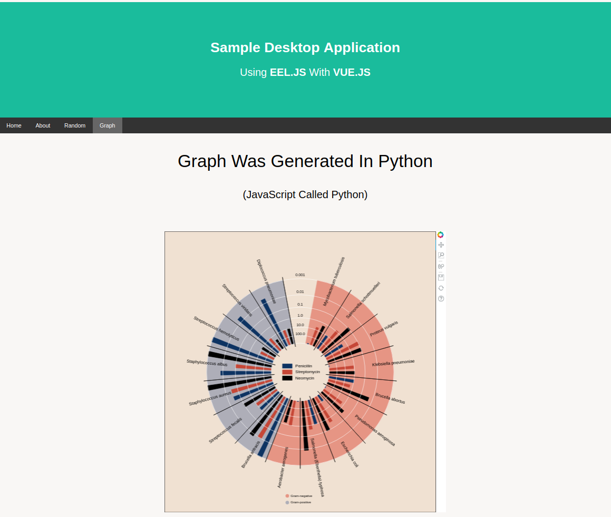

# Python/JavaScript Desktop Application Based On EEL.JS & VUE.JS

>  Electron-like desktop application based on EEL.JS to enable two-way communication between
JavaScript (front-end) and Python (back-end).

<br/>

 Python Version: 3.6.8
> Enables deployment with PyInstaller

<br/>

This sample leverages the following projects:
>[https://github.com/ChrisKnott/Eel](https://github.com/ChrisKnott/Eel)<br/>
>[https://github.com/chrisvfritz/vue-2.0-simple-routing-example](https://github.com/chrisvfritz/vue-2.0-simple-routing-example/)<br/>
>[https://bokeh.pydata.org/en/latest/docs/gallery/burtin.html](https://bokeh.pydata.org/en/latest/docs/gallery/burtin.html)<br/>
>[https://www.w3schools.com/howto/howto_js_sticky_header.asp](https://www.w3schools.com/howto/howto_js_sticky_header.asp)

<br/>

## Build Setup
``` bash
# cd to the root directory
# activate your virtualenv
# run the following
pip install -r requirements.txt

# cd to the web directory and run the following:

# make executable
chmod +x ./deploy.sh
chmod +x ./build.sh

# install dependencies
npm install

# build the application
npm run eel:build

# build for production  
npm run eel:deploy
```

<br/>

## Graph Page Screenshot


